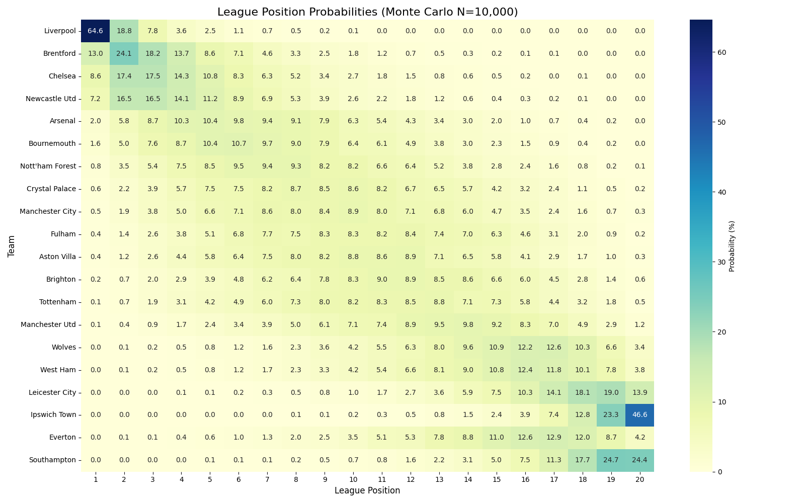
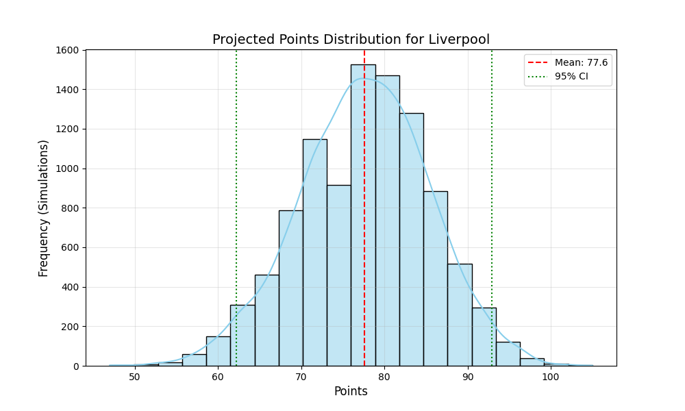
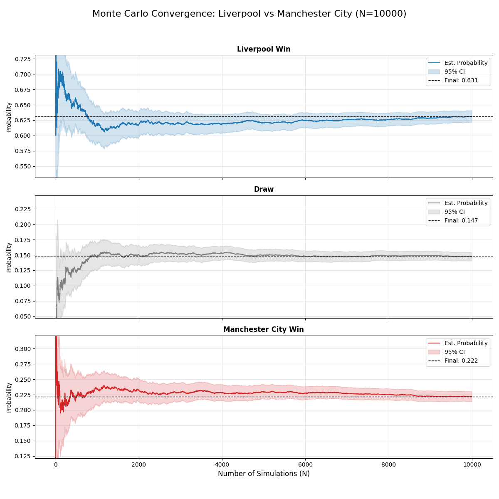

# Premier League Monte Carlo Simulator

This project implements a **Monte Carlo Simulation** to predict the outcomes of the English Premier League. By leveraging player statistics (Expected Goals, Expected Assists, Progression stats) and team performance metrics, the simulator models individual match probabilities and aggregates them to forecast the entire league season.

## 🎯 Motivation: Why this Project?

We chose to simulate the Premier League for three key reasons, aligning with the core principles of Monte Carlo simulations:
1.  **Stochastic Nature:** Football is inherently probabilistic. A stronger team doesn't always win; luck, form, and random events (red cards, deflections) play a huge role. Deterministic models fail to capture this variance, making Monte Carlo (which uses random sampling) the ideal tool.
2.  **High-Dimensional Data:** Modern football offers granular data (xG, xAG, Progressive Carries) which allows for a complex, bottom-up model where a team's strength is derived from individual player contributions, not just an arbitrary "Team Rating."
3.  **Tangible Probability Estimation:** The goal of predicting a "Top 4 Finish" or "Relegation" requires a probability distribution, not a single prediction. Running thousands of seasons allows us to say "Arsenal has a 42% chance of winning," which is far more valuable than simply predicting "Arsenal will win."

---

## 📌 Project Overview & Methodology

### 1. The Monte Carlo Approach
Our simulation treats every match as an experiment with random variables. By repeating the entire season (380 matches) $N=10,000$ times, we generate a distribution of possible outcomes.

### 2. From Data to Match Simulation
The core logic transforms static CSV data into dynamic match scores through the following pipeline:

#### Step A: Calculating "Moment Power"
In any given match, a team performs slightly differently than their theoretical average. We model this by injecting **Gaussian Noise** into their base power ratings.

$$Att_{match} = Att_{base} \cdot (1 + \mathcal{N}(0, \sigma))$$

$$Def_{match} = Def_{base} \cdot (1 + \mathcal{N}(0, \sigma))$$

*   $\sigma$ (Sigma) is a trained parameter representing the team's volatility (consistency).

#### Step B: The Scoring Model (Poisson Process)
We model goal-scoring as a **Poisson Process**, which is the standard statistical approach for counting rare events over a fixed time.
The expected number of goals ($\lambda$) for the Home Team is calculated as:

$$\lambda_{home} = AvgGoals \times \exp\left( \frac{Att_{home} - Def_{away}}{S} \right) \times HomeAdv$$

**Why this formula?**
1.  **Baseline:** If $Att_{home} \approx Def_{away}$, the exponent becomes 0, $\exp(0)=1$, and the team scores the league average ($\approx 1.6$).
2.  **Scaling ($S$):** The "Scaling Factor" $S$ (optimized during training) converts the raw difference in "Skill Points" into a meaningful ratio for goal probability.
3.  **Non-Linearity:** The exponential function ensures that a vastly superior attack scores significantly more, while a weaker attack is punished, without producing negative goals.

#### Step C: Generating the Score
Finally, we sample the actual goals from the Poisson distribution:

$$Goals_{Home} \sim Poisson(\lambda_{home})$$

$$Goals_{Away} \sim Poisson(\lambda_{away})$$

---

## 🧠 Model Training & Parameter Optimization

Instead of using arbitrary "FIFA Ratings", our model's logic is derived from a **Training Phase** (`hyperparameter_search.py`). We optimize the model to minimize the difference (Mean Squared Error) between our simulations and real-world standings.

### 1. Player Metrics (The "Inputs")
We process every player in the dataset, calculating two key metrics based on weighted formulas.

**A. Attacking Score:**
We don't just count Goals. We prioritize underlying metrics that predict future performance:

$$S_{att} = (Gls \cdot w_{gls}) + (Ast \cdot w_{ast}) + (xG \cdot w_{xg}) + (xAG \cdot w_{xag}) + (Prog \cdot w_{prg})$$

*   **$w_{xg}$ vs $w_{gls}$:** Our training typically finds that $xG$ (Expected Goals) has a higher weight than raw Goals, as it is a better measure of quality chances created, removing "lucky" finishes from the equation.

**B. Defensive Score:**
Defensive stats are harder to quantify. We use a combination of starts and minutes played as a proxy for a player's defensive reliability and importance to the squad structure.

$$S_{def} = (Starts \cdot 2) + \frac{Minutes}{45}$$

**C. The Goalkeeper:**
Goalkeepers are treated uniquely. Their contribution is weighted solely on their presence (Starts/Minutes) but scaled significantly higher in the Team Power calculation because a team without a goalkeeper would concede infinite goals.

### 2. Positional Weights (Tactical Balance)
A team isn't just a sum of numbers. A Striker contributes 100% to Attack but little to Defense. A Midfielder contributes to both. We optimize these ratios:
*   $w_{att\_def}$: How much an Attacker contributes to Defense.
*   $w_{mid\_att}$: How much a Midfielder contributes to Attack.
*   $w_{def\_att}$: How much a Defender contributes to Attack.

**Total Team Power Formula:**

$$Power_{Team} = \sum_{p \in Lineup} (S_{p} \times PositionWeight_{p})$$

---

## 📐 Mathematical Proof: Determining N

We must define the number of simulations $N$ required to trust our results. Our goal is to estimate an unknown probability $p$ (e.g., "Probability that Man City wins the league") with a **95% Confidence Level** and a **Margin of Error** ( $\epsilon$ ) **of approximately 1%**.

### Step 1: The Estimator
We model the outcome of each simulation $i$ as a Bernoulli random variable $X_i$, where $X_i=1$ if the event occurs (e.g., Team Wins) and $X_i=0$ otherwise.
The true probability is $p = E[X_i]$.
Our estimator is the sample mean $\hat{p}$:

$$\hat{p} = \frac{1}{N} \sum_{i=1}^{N} X_i$$

### Step 2: The Variance
The variance of a single Bernoulli trial is:

$$\sigma^2 = p(1-p)$$

### Step 3: Application of Central Limit Theorem (CLT)
The Central Limit Theorem states that for a sufficiently large $N$, the distribution of the sample mean $\hat{p}$ approximates a Normal Distribution:

$$\hat{p} \sim \mathcal{N}\left(p, \frac{p(1-p)}{N}\right)$$

### Step 4: Confidence Interval Derivation
We seek a confidence interval such that:

$$P( | \hat{p} - p | \leq \epsilon ) = 1 - \alpha$$

For a 95% confidence level, $\alpha = 0.05$. This corresponds to a critical Z-score ( $Z_{\alpha/2}$ ) of approximately **1.96**.
The margin of error $\epsilon$ is therefore:

$$\epsilon = Z_{\alpha/2} \cdot \sigma_{\hat{p}} = 1.96 \cdot \sqrt{\frac{p(1-p)}{N}}$$

### Step 5: Solving for N (Worst Case Scenario)
We do not know the true probability $p$ beforehand. To guarantee the error margin holds for *any* outcome, we must assume the **worst-case variance**.
The term $p(1-p)$ is maximized when $p = 0.5$ (maximum uncertainty).

$$\max(p(1-p)) = 0.5 \cdot 0.5 = 0.25$$

So the inequality becomes:

$$\epsilon \ge 1.96 \cdot \sqrt{\frac{0.25}{N}}$$

$$\sqrt{N} \ge \frac{1.96 \cdot 0.5}{\epsilon} = \frac{0.98}{\epsilon} = \frac{0.98}{0.01} = 98$$

$$N \ge 98^2 = 9604$$

### Conclusion
We require theoretically **9,604 simulations** to ensure a ≤1% margin of error. In our project, we round this up to **N=10,000** for robustness.

---

## 📊 Visualizations

The project generates high-quality plots to help interpret the results. These visual tools are essential for understanding the stochastic nature of the simulation.

### A. League Position Heatmap
A color-coded matrix showing the probability of every team finishing in every position (1-20). This provides a much richer understanding than just "Average Points."



### B. Points Distribution Histogram
A histogram showing the probable point totals for a specific team. The dashed lines indicate the **95% Confidence Interval**, showing the "floor" and "ceiling" of a team's potential performance.



### C. Match Convergence Plot (Visual Proof)
When simulating a specific match, we generate a convergence plot. This is the **empirical proof** of the math section above. It shows the win probability stabilizing as $N \rightarrow 10,000$, with the blue confidence band narrowing exactly as predicted by the $1/\sqrt{N}$ factor.



---

## 💻 Code Structure & Function Description

This project is modular, separating data, logic, and visualization.

### `src/models.py`
*   **`Player` Class:**
    *   **Role:** Stores individual stats.
    *   **Key Logic:** Calls `calculate_player_metrics` upon initialization to convert raw CSV rows into $S_{att}$ and $S_{def}$.
*   **`Team` Class:**
    *   **`get_default_11()`:** Algorithms to pick a valid 4-3-3 lineup (1 GK, 4 DEF, 3 MID, 3 ATT) based on minutes played. Essential for avoiding "glass cannon" teams with 10 strikers.
    *   **`calculate_power(params)`:** The aggregator. Sums up the stats of the active lineup, applying the Positional Weights to return the final `(Attack, Defense)` tuple.

### `src/league.py`
*   **`League` Class:**
    *   **`simulate_match_fast(h_att, h_def, ...)`:** The optimized core engine. It takes pre-calculated float values (Power) and returns integer scores (Goals). It performs the Noise Injection and Poisson Sampling described above.
    *   **Optimization:** We split power calculation from simulation. We calculate Team Power *once* per season, then run 10,000 math-only simulations. This makes the code ~100x faster than recalculating player sums every loop.

### `src/visualizer.py`
*   Uses `matplotlib` and `seaborn` to generate professional plots.
*   **`plot_convergence`:** Visualizes the Law of Large Numbers by plotting the running average of probabilities.
*   **`plot_league_heatmap`:** Creates the 20×20 grid showing the probability of every position for every team.

### `hyperparameter_search.py`
*   **Purpose:** The "AI" component. It uses **Random Search** across a defined hyperparameter space.
*   **Parallelism:** Uses Python's `multiprocessing` to run hundreds of seasons in parallel on all CPU cores to find the optimal weights ( $w_{xg}$, $S$, $\sigma$ ) that minimize error against the Ground Truth table.

---

## 🛠️ Requirements

Before running the project, ensure you have the following Python libraries installed:
- `numpy` (Math & Arrays)
- `pandas` (Data Processing)
- `matplotlib` & `seaborn` (Visualization)
- `tqdm` (Progress Bars for training)

```bash
  pip install numpy pandas matplotlib seaborn tqdm
```

## 🚀 How to Use

### 1. Train the Model
To re-optimize the mathematical weights against new data:
```bash
  python hyperparameter_search.py
```

### 2. Interactive Mode (Recommended)
The primary interface for users.
```bash
  python interactive_session.py
```
*   **Simulate League:** Runs 10,000 full seasons. View the **Position Heatmap** to see the probabilistic standings.
*   **Simulate Match:** Predict a specific game (e.g., Liverpool vs City) and visualize the **Convergence Plot**.
*   **Custom Teams:** Create your own team from the database and insert it into the league.

## 📚 References
1.  **FBref.com:** Source of the 2024-25 Premier League player statistics.
2.  **Central Limit Theorem:** Mathematical foundation for determining N.
3.  **Poisson Distribution:** The statistical standard for modeling low-scoring event frequencies (goals).
